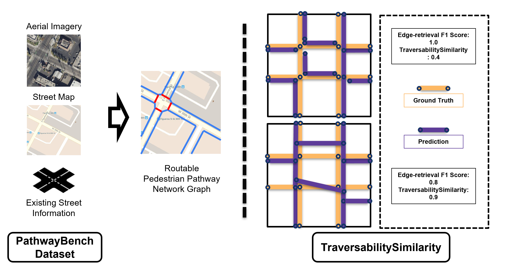

# PathwayBench: A Benchmark for Extracting Routable Pedestrian Path Network Graphs

<p align="center"></p>


This package contains the PathwayBench dataset and benchmark for extracting routable pedestrian pathway graphs. The dataset includes aerial images, road graphs, road rasters, and ground truth data for multiple cities.

- **Metadata**: [PathwayBench Croissant metadata](./metadata/PathwayBench_metadata.jsonld)
- **License**: [ODbL](https://opendatacommons.org/licenses/odbl/)


## Installation

```shell
# create and activate the conda environment
conda create -n pathwaybench python=3.8
conda activate pathwaybench
Clone the repository and install locally as a package:

```bash
git clone https://github.com/your-username/pathways-bench.git
cd pathways-bench
pip install .
```
This code has been tested with Python 3.10. macOS: Sequoia


## Dependencies

```python
geopandas==0.14.3
osmnx==1.6.0
geonetworkx==0.5.3
networkx==3.2.1
shapely==2.0.3
fiona==1.9.6
coverage
dask_geopandas
```

## Datasets
Each set of samples in the PathwayBench dataset includes five co-registered features. The filename of each set of samples and the corresponding features are listed below:

| Filename | Feature Type
|--|--|
| xxxx_aerial.png | The aerial satellite imagery.
| xxxx_road.geojson | The street (road) graph.
| xxxx_road.png | The rasterized street map (with additional features).
| xxxx_gt_graph.geojson | The human-validated pedestrian pathway graph.
| xxxx_gt_mask.png | The rasterized human-validated pedestrian pathway graph to support semantic segmentation tasks.
| xxxx_gt_color.png | The color-coded version of xxxx_gt_mask.png for visualization purposes.

Below are the links to the dataset that are currently supported by PathwayBench
| City | Data |
|--|--|
| Seattle, WA| [Link to dataset](https://drive.google.com/drive/folders/1CnTVuARwv7j-9WXXJpAb3l6NC3n0nhO9?usp=sharing)
| Washington, D.C. | [Link to dataset](https://drive.google.com/drive/folders/1anMEeDbUZPquwEMGA8V3YPeWQJxFHDnu?usp=sharing)
| Portland, OR | [Link to dataset](https://drive.google.com/drive/folders/1yFViA6PaDxqQWvS_iqDay65pEMijiS05?usp=sharing)
| Bellevue, WA | [Will be released soon]
| Quito, Ecuador | [Will be released soon]
| Sao Paulo, Brazil | [Will be released soon]
| Santiago, Chile | [Will be released soon]  
| Valparaiso, Chile | [Will be released soon]  


## Pathways Bench Benchmark

Evaluate predicted map data against ground truth over tessellated tiles. This package gives you a light, composable Python API for:

- Building TIP tiles (Voronoi cells) using an input dataset’s **convex hull + OSM** roads
- Computing per-tile edge and node statistics (tp/fp/fn + "traversability" pairs)
- Summarizing precision/recall/F1 and traversability similarity
- (Optional) Writing a per-TIP **scores** GeoJSON with a ts (traversability similarity) column

## Install
Add the package in your requirements.txt or install it directly: 
```
pathways-bench
```
or 
```python
pip install pathways-bench
```
**Requires:** Python 3.9+, GeoPandas, Shapely 2, Fiona/GDAL, Dask-GeoPandas, NetworkX, OSMnx, GeoNetworkX, NumPy, Pandas.
Shapely 2 note: by default the package sets `USE_PYGEOS=0` internally (you can override with `use_pygeos=True` in the APIs).


## Quick Start

### End-to-end (recommended)

```python
from pathways_bench import PathwaysBench

pb = PathwaysBench(
    gt_file="data/gt_edges.geojson",
    prediction_file="data/pred_edges.geojson",
    output="out/",              # will hold all outputs
    proj="epsg:26910",          # target CRS (auto-reprojected)
    debug=False
)

summary = pb.stats(threshold=5, buffer_size=5)

print(summary)
# {
#   'file': 'pred_edges_stats.geojson',
#   'mode': 'edge',
#   'precision': 0.73,
#   'recall': 0.64,
#   'f1': 0.68,
#   'traversability_similarity': 0.33,
#   'scores_path': 'out/pred_edges_scores.geojson'  # ← per-TIP TS file
# }

```
This will:

1. **Tessellate:** Create a `*_tip.geojson` using the **convex hull** of `gt_file` to fetch OSM roads and build Voronoi tiles.
2. **Evaluate:**
   - Compute **predicted edge stats per tile** against GT (*_stats.geojson). 
   - Compute **GT vs GT** edge stats per tile (for traversability comparison).
3. **Summarize:** Precision/Recall/F1 + Traversability Similarity (Jaccard on connected edge pairs).
4. **Write scores:** A *_scores.geojson with a ts column (per-tile traversability similarity).

### API Overview


#### Tessellate

Build tiles (TIPs) from an input file by:
- Taking the convex hull of all geometries
- Downloading **OSM** drive network within that hull
- Building and clipping a **Voronoi** diagram to the hull

```python
from pathways_bench import Tessellate

tip_path = Tessellate(
    filepath="data/gt_edges.geojson",
    proj="epsg:26910",
    output="out/",
    use_pygeos=False
).area()

print(tip_path)  # 'out/gt_edges_tip.geojson' (or alongside the input if no output dir)

```
#### GeoStatsEvaluator

Compute per-tile stats (uses Dask-GeoPandas under the hood):
```python
from pathways_bench import GeoStatsEvaluator

ev = GeoStatsEvaluator(
    proj="epsg:26910",
    e_threshold=5.0,        # match acceptance threshold (CRS units)
    buffer_size=5.0,        # buffer around lines during matching (CRS units)
    num_partitions=32,
    output="out/",
    use_pygeos=False
)

res = ev.run(
    tile="out/gt_edges_tip.geojson",
    edges="data/pred_edges.geojson",
    gt_edges="data/gt_edges.geojson",
    # optional node evaluation (curbs + curb-links)
    # nodes="data/pred_nodes.geojson",
    # gt_nodes="data/gt_nodes.geojson",
)

print(res["saved_paths"])
# {
#   'pred_edge_stats': 'out/pred_edges_stats.geojson',
#   'gt_edge_stats':   'out/gt_edges_gt_stats.geojson',
#   # optionally:
#   # 'curb_stats': 'out/pred_nodes_curb_stats.geojson',
#   # 'curb_link_stats': 'out/pred_nodes_curb_link_stats.geojson'
# }

print(res["edge_summary"])
# {'traversability': 0.33, 'precision': 0.73, 'recall': 0.64, 'f1': 0.68}

```

**Outputs (edge stats per tile)**

- `total_edges` – number of boundary edge-pairs considered
- `connect_edges` – number of boundary edge-pairs connected through the graph
- `connected_pairs` – space-separated string like `"(0,0) (0,1) (1,3)"` indexing polygon edge-pairs
- `tp`, `fp`, `fn` – counts from line matching (angle and distance-based)
- `geometry` – tile polygon

**Optional nodes (curbs & curb-links)**

If you pass `nodes` & `gt_nodes`, the evaluator filters on:
- predicted curbs: column/value `("ext:node_type", "curb")`
- gt curbs: column/value `("barrier", "kerb")`

It also builds "curb-link" nodes by joining node IDs to edge endpoints (`_id`, `_u_id`, `_v_id` expected).

#### ScoreReporter

Summarize a saved stats file and (optionally) write the **per-TIP** scores file:
```python
from pathways_bench import ScoreReporter

rep = ScoreReporter(
    pred_path="out/pred_edges_stats.geojson",
    gt_path="out/gt_edges_gt_stats.geojson",
    use_pygeos=False
)

status = rep.run()
print(status)
# {'file': 'pred_edges_stats.geojson', 'mode': 'edge', 'precision': ..., 'recall': ..., 'f1': ..., 'traversability_similarity': ...}

# Write per-tile TS file (like the original `create_score_json` + write):
scores_path = rep.save_scores_geojson()    # -> 'out/pred_edges_scores.geojson'

```

If your stats use a non-standard column for connected pairs, pass it and we’ll keep MetricsHelper in sync:
```python
rep = ScoreReporter(pred_path=..., gt_path=..., connected_pairs_col="pairs_str")
rep.save_scores_geojson()

```

#### Data & CRS

- All inputs are auto-reprojected to the evaluator's `proj` (default `EPSG:26910`).
- Tessellation uses OSMnx's drive network within the input's **convex hull**.
- Node evaluation expects
   - Predicted nodes column/value: `ext:node_type == "curb"`
   - GT nodes column/value: `barrier == "kerb"`
   - Edge-node linkage columns on edges: `_u_id`, `_v_id`; node IDs as `_id`.

#### Performance notes

- Tile evaluation uses Dask-GeoPandas with `npartitions` (default 32) and a `multiprocessing` scheduler.
- OSM download happens once per tessellation call; cache externally if you'll run repeatedly on the same area.
- The edge matcher uses angle filtering + buffered overlay + endpoint sampling; heavy geometries can be slow.

#### Outputs recap

- `*_tip.geojson` – Voronoi tiles clipped to the convex hull (tessellation)
- `*_stats.geojson` – per-tile stats for predicted edges
- `*_gt_stats.geojson` – per-tile stats for ground-truth edges (for traversability comparison)
- `*_scores.geojson` – per-tile traversability similarity (`ts`) appended to predicted stats

#### Troubleshooting

- `Fiona/GDAL errors` when reading files → ensure files exist and drivers are installed; try opening with `gpd.read_file` in a REPL.
- Shapely errors with overlays/buffers → keep `use_pygeos=False` (default) unless your environment is configured for PyGEOS compatibility.
- `OSMnx timeouts` → try smaller areas or set up an HTTP cache; ensure internet access.

### Minimal reproducible example (toy geometry)

```python
from shapely.geometry import LineString
import geopandas as gpd

# tiny GT and prediction (same CRS)
gt = gpd.GeoDataFrame(geometry=[LineString([(0,0),(1,0)])], crs="EPSG:4326")
gt.to_file("gt_edges.geojson", driver="GeoJSON")

pred = gpd.GeoDataFrame(geometry=[LineString([(0,0),(1,0.01)])], crs="EPSG:4326")
pred.to_file("pred_edges.geojson", driver="GeoJSON")

from pathways_bench import PathwaysBench
pb = PathwaysBench(gt_file="gt_edges.geojson", prediction_file="pred_edges.geojson", output="out/")
print(pb.stats())

```

### Unit Tests

Run unit tests to ensure the package works as expected:

```bash
> python -m coverage run --source=src/pathways_bench -m unittest discover -s tests/unit_tests
 
......./pathways-bench/src/pathways_bench/geo_evaluator.py:429: UserWarning: Geometry is in a geographic CRS. Results from 'distance' are likely incorrect. Use 'GeoSeries.to_crs()' to re-project geometries to a projected CRS before this operation.

  gt = gt.assign(dist=gt.geometry.distance(pred_pt))
/pathways-bench/src/pathways_bench/geo_evaluator.py:429: UserWarning: Geometry is in a geographic CRS. Results from 'distance' are likely incorrect. Use 'GeoSeries.to_crs()' to re-project geometries to a projected CRS before this operation.

  gt = gt.assign(dist=gt.geometry.distance(pred_pt))
.............................................[INFO] Tessellate: Starting tessellation process...
[INFO] Tessellate: Saving output to /var/folders/bj/1x3sl5k568j0zn9cyf3vlykw0000gn/T/tmpoltc9v6s/input_tip.geojson
.[INFO] Tessellate: Starting tessellation process...
[INFO] Tessellate: Saving output to /var/folders/bj/1x3sl5k568j0zn9cyf3vlykw0000gn/T/tmp1v52_vss/input_tip.geojson
.[INFO] Tessellate: Starting tessellation process...
[INFO] Tessellate: Saving output to /var/folders/bj/1x3sl5k568j0zn9cyf3vlykw0000gn/T/tmpnb9ptq2_/tiles/input_tip.geojson
....[ERROR] Tessellate: Failed to read GeoJSON: bad input
.[ERROR] Tessellate: File not found: /var/folders/bj/1x3sl5k568j0zn9cyf3vlykw0000gn/T/tmpr3jo89qb/nope.geojson
...
----------------------------------------------------------------------
Ran 62 tests in 0.248s

OK
```

### Coverage Report

```bash
> coverage report
----------------------------------------------------------
src/pathways_bench/__init__.py            42      2    95%
src/pathways_bench/geo_evaluator.py      291     21    93%
src/pathways_bench/helpers.py             50      0   100%
src/pathways_bench/logger.py              10      0   100%
src/pathways_bench/score_reporter.py      55      2    96%
src/pathways_bench/tessellate.py          59      0   100%
src/pathways_bench/version.py              1      0   100%
----------------------------------------------------------
TOTAL                                    508     25    95%
```
